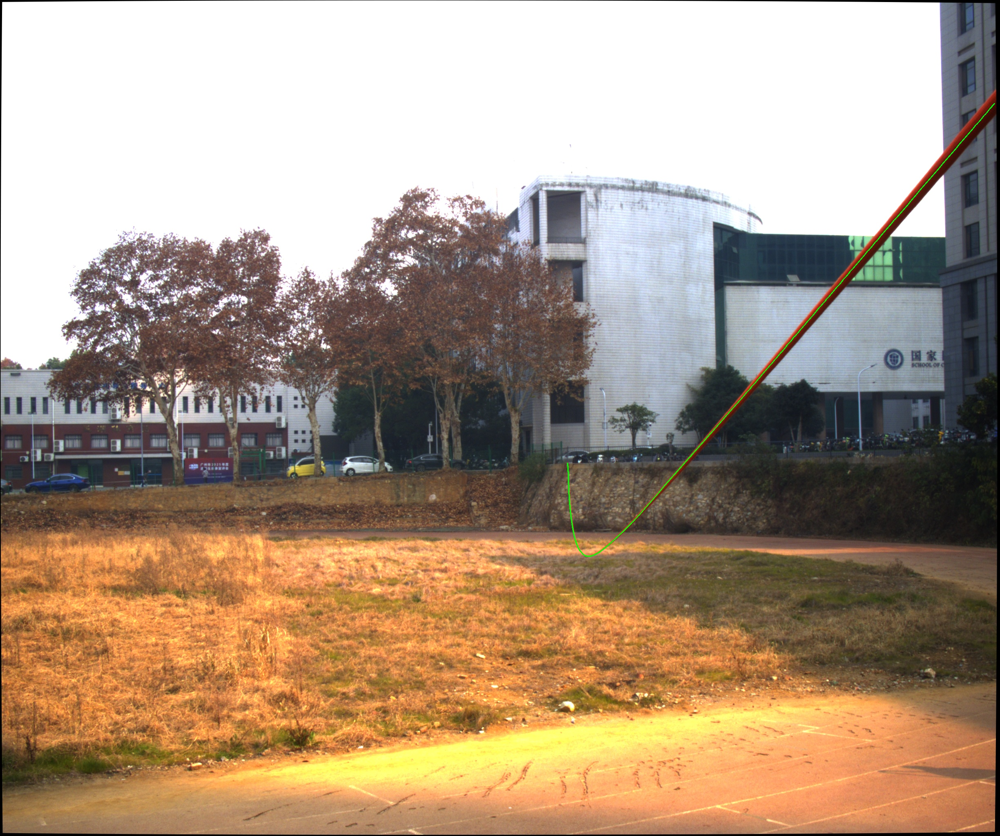
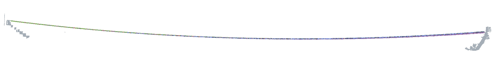

# LC-CurveModel: Joint camera-lidar spatial curve modeling
<!-- markdownlint-disable MD047 -->
The purpose of this repository is to reconstruct complete spatial models of power lines using LiDAR and cameras. We treat power lines as spatial curves and reconstruct them using both parabolic equations and catenary equations. Using simulation results as an example, the reconstruction results can be seen in the following two images.

Demo: Curve selection on image  

  

Demo: Curve restruction in 3D space  

  

## Structure  

lc_core       -- core algorithm module  
lc_preprocess -- pre-process module  
lc_simulation -- simple simulation module  
lc_tools      -- auxiliary python scripts

## Dependencies

- Eigen(3.4.0 or other version)
- OpenCV(4.2.0 or other version)
- Ceres(2.1.0 or other version)
- GLOG/GFLAGS
- yaml-cpp

## Installation

1. Install the required dependencies.

2. Clone the repository:

    ```bash
    git clone https://github.com/zzzzyp-sgg/LC-CurveModel.git
    ```

3. Build the program:

    ```bash
    mkdir build && cd build
    cmake ..
    make -j8
    ```

## Example  

1. Extract image and pcd file from rosbag

    ```bash
    python lc_tools/rosbag_extraction.py <bag_path> <image_topic> <lidar_topic>
    ```

2. Transmission line point cloud extraction  

    ```bash
    bin/ppTest -x_threshold <x_threshold> -z_threshold <z_threshold> -pcd_path <pcd_path>
    ```

3. Select curve on image  
    
    ```bash
    python lc_tools/line_selection.py <image_path> <points_file>
    ```

4. Run lc_core

    ```bash
    bin/test -yaml <yaml_file> -visualize <true/false>
    ```

## License

This project is licensed under the [GNU General Public License v3.0](LICENSE).
